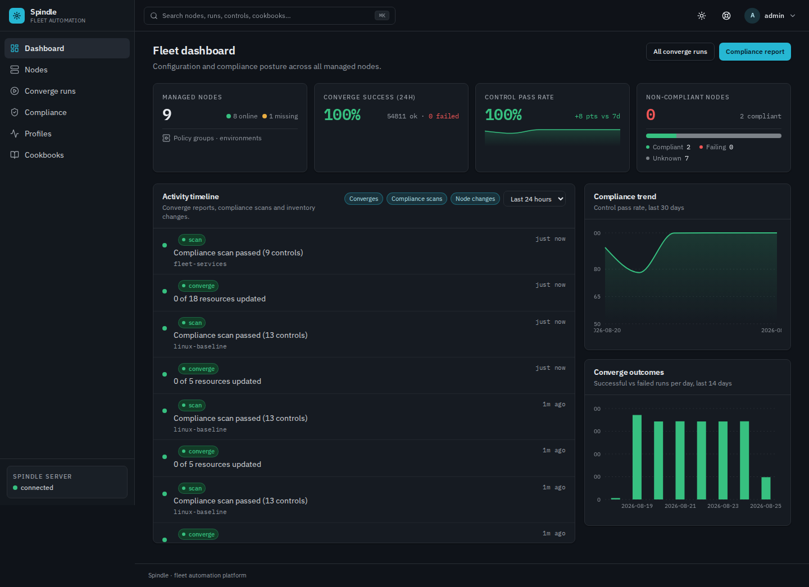
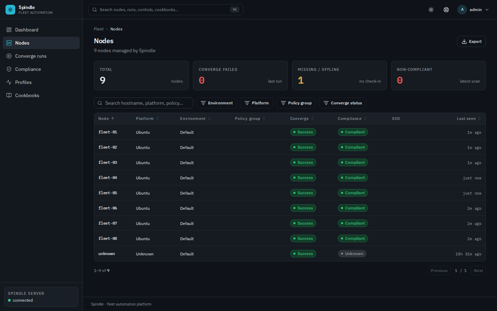
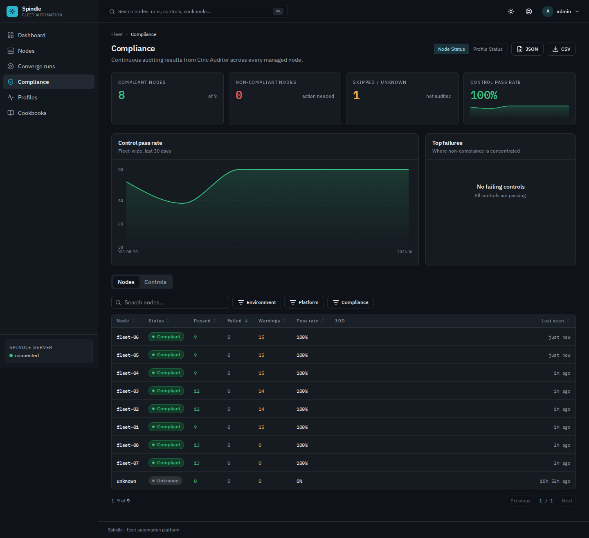
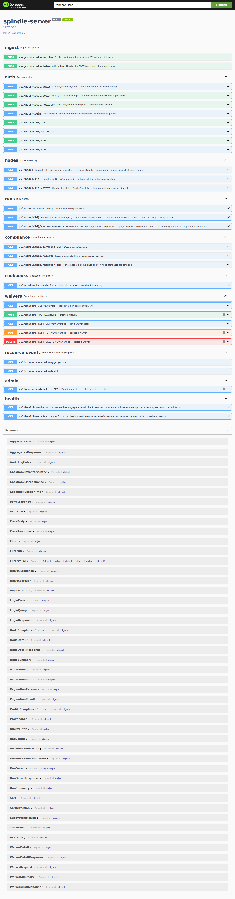

# Multi-Channel Observability

Spindle is a fleet-automation and continuous-compliance observability platform
for CINC fleets. It ingests **CINC Client converge runs** (configuration applied
per node) and **CINC Auditor compliance scans** (profiles/controls evaluated per
node), persists them in PostgreSQL, and exposes fleet state over **four
channels** — each tuned for a different consumer.

This document demonstrates Spindle observing a **live 9-node fleet** through all
four channels. Captures are real, not mocked. At capture time the fleet was
driving its own converge+auditor pipeline on a low cadence:

| Fleet state | Value |
|---|---|
| Nodes | 9 (8 online / 1 offline) |
| Successful converges | ~62,700 (0 failed) |
| Compliance | 8 compliant / 0 non-compliant / 1 unknown |
| Converge cadence | Live (≈3-min), resource events flowing |

> All screenshots and payloads below were sanitized for the public repo: no
> internal IPs or tokens appear in the rendered output.

---

## Channel 1 — Dashboard (visual)

**Audience:** human operator scanning fleet health at a glance.

The dashboard renders the live fleet as KPI cards, trend charts, and tables:



- **Fleet KPIs** — 9 managed nodes (8 online / 1 offline), 100% converge
  success (`~62k ok / 0 failed`), and an accurate compliance breakdown
  (8 compliant / 0 failing / 1 unknown).
- **Trend charts** — live *Compliance trend* (control pass rate, 30 days) and
  *Converge outcomes* (successful vs failed runs / day). These render real
  series from the API — not placeholders.
- **Activity timeline** — the most recent converge + compliance-scan events
  with their outcome (e.g. *"Compliance scan passed (13 controls)"*).



- **Node inventory** is a sortable table with per-node converge + compliance
  status pills. The **offline node** is flagged by the `MISSING / OFFLINE`
  counter and a stale `last seen`, and its compliance renders **Unknown**
  rather than a false green.
- Clicking a node opens its detail page (attributes, run_list, platform,
  last check-in, compliance posture, and tabs).



- The **Compliance** page shows the node-status / profile-status toggle, a
  pass/fail summary (8 compliant / 0 non-compliant / 1 skipped-unknown), and a
  control pass-rate trend. The Control breakdown view renders live per-node
  pass/fail/warning counts.

**Channel answer:** *"Is my fleet healthy right now, and what changed recently?"*

---

## 2 — REST API + OpenAPI

**Audience:** integrators, scripts, and tools that consume fleet state
programmatically.

The query API is token-authenticated and self-describing via an OpenAPI spec
with a live Swagger UI at `/docs`.



### Representative calls

| Endpoint | What it returns | Operator insight |
|---|---|---|
| `GET /v1/summary` | Fleet roll-up `{total:9, online:8, offline:1, convergeSuccess:~62k, convergeFailed:0, compliant:8, nonCompliant:0, unknownCompliance:1}` | One call for overall fleet health. |
| `GET /v1/nodes?limit=3` | Node identity + `run_list` + `last_seen` (fresh, seconds ago) | Confirms live converge cadence and inventory. |
| `GET /v1/runs?limit=5` | Newest-first run log, e.g. `fleet-07` converged 5 resources in 542 ms | See which nodes recently ran and whether they changed state (`updated_count`). |
| `GET /v1/compliance/reports?limit=3` | Latest Cinc Auditor scans, e.g. `linux-baseline` passed (13 controls), `fleet-services` warn (9 passed / 15 warnings) | Spot a control that just started failing. |
| `GET /v1/resource-events/drift` | Currently `[]` — no resource drift detected | Empty = fleet at desired state (the GOOD signal). |
| `GET /v1/resource-events/aggregates?limit=5` | Hourly rollup, e.g. `base` v0.5.1 `apt_package` on ubuntu, 1239 events this hour + latency percentiles | How much converge work per hour and whether actions are slow. |
| `GET /v1/health` | `status: up`, database/storage/dex all up, `ingest_lag.queue_depth=0` | Liveness + dependency health + ingest backlog. |

**Channel answer:** *"Give me fleet state I can script, join, and automate."*

---

## 3 — MCP server (agent-native)

**Channel:** autonomous agents that need safe, structured access to the fleet.

`/usr/local/bin/spindle-mcp` serves a **Model Context Protocol** namespace over
newline-delimited JSON-RPC (stdio), so an agent does an `initialize` handshake,
lists tools, and calls them to observe/triage the fleet.

### Namespaces (16 tools total)

| Namespace | Tools | Purpose |
|---|---|---|
| `spindle-query` (11) | `list_nodes`, `get_node`, `list_runs`, `get_run`, `list_resource_events`, `list_compliance_reports`, `get_compliance_report`, `list_cookbooks`, `get_cookbook`, `aggregate_resources`, `detect_drift` | Read-only fleet observation |
| `spindle-ops` (3) | `health_check`, `get_metrics`, `queue_depth` | Health / metrics / ingest queue |
| `spindle-admin` (2) | `create_waiver`, `revoke_waiver` | Write ops (compliance waivers) |

### Example: `tools/call list_nodes`

```json
{
  "id": 3, "jsonrpc": "2.0",
  "result": { "content": [ { "text": "{\"data\":[
    {\"name\":\"fleet-08\",\"platform\":\"ubuntu\",\"node_type\":\"cinc-client\",\"last_seen\":\"2026-08-26T02:44:15Z\",\"run_list\":[\"recipe[base]\"]},
    {\"name\":\"fleet-01\",\"platform\":\"ubuntu\",\"node_type\":\"cinc-client\",\"last_seen\":\"2026-08-26T02:44:13Z\",\"run_list\":[\"recipe[base]\",\"recipe[base::nginx]\"]},
    {\"name\":\"fleet-07\",\"platform\":\"ubuntu\",\"node_type\":\"cinc-client\",\"last_seen\":\"2026-08-26T02:44:08Z\",\"run_list\":[\"recipe[base]\"]}],
    \"pagination\":{\"has_more\":true}}" } ] }
}
```

**Channel answer:** *"an agent observes the fleet via MCP — enumerate nodes,
runs, compliance, and drift read-only, then act through the ops/admin
namespaces."*

---

## 4 — Prometheus metrics

**Channel:** SRE / alerting. The server exposes native Prometheus-format
metrics at `/metrics` (default Prometheus path, same `:3000` port).

```
# HELP spindle_ingest_requests_total Total number of ingest API requests by HTTP status.
# TYPE spindle_ingest_requests_total counter
spindle_ingest_requests_total{status="202"} 1858    # accepted converge+compliance events, climbing live
spindle_ingest_requests_total{status="500"} 0
# HELP spindle_queue_depth Number of unprocessed messages in the ingest queue.
spindle_queue_depth 0
# HELP spindle_queue_lag_seconds Age of oldest unprocessed message in queue (seconds).
spindle_queue_lag_seconds 0
# HELP spindle_pipeline_processed_total ...
spindle_pipeline_processed_total 0
# HELP spindle_query_requests_total ...
spindle_query_requests_total{endpoint="nodes"} 44    # read traffic
spindle_query_requests_total{endpoint="runs"} 31
# HELP spindle_dead_letter_total ...
spindle_dead_letter_total 0
```

A `prometheus.yml` scrapes it as any standard exporter:

```yaml
scrape_configs:
  - job_name: spindle
    metrics_path: /metrics
    static_configs:
      - targets: ['192.0.2.15:3000']
```

**Which metrics drive alerts:**

- **Ingest 5xx rate** — `rate(spindle_ingest_requests_total{status=~"5\\d\\d"}[5m]) > 0`
  → converge/compliance reports are being rejected and lost.
- **Ingest lag / queue depth** — `spindle_queue_depth > N` or
  `spindle_queue_lag_seconds > 300` → the worker isn't consuming; dashboards
  go silent.
- **Node-offline count** — not exposed as a counter here; derive from
  `GET /v1/nodes` (alert when `online < total`). `/v1/health`'s
  `ingest_lag.queue_depth` is the live queue-health proxy.

**Channel answer:** *quantitative, time-series fleet signals for dashboards and
alerting.*

---

## Which channel when?

| Goal / consumer | Channel |
|---|---|
| **Operator** — glance at fleet health, spot flags, drill into a node | Dashboard / visual |
| **Integration / script** — pull fleet facts into another system | API + OpenAPI `/docs` |
| **Agent** — autonomous LLM agent queries & (scope-limited) acts on the fleet | MCP server |
| **SRE / alerting** — long-term trends, thresholds, paging | Prometheus `/metrics` |